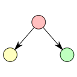
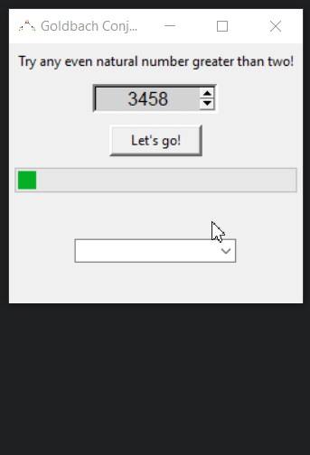

# Goldbach Conjecture Python

A Python implementation of the Goldbach Strong Conjecture.

## What is the Goldbach Strong Conjecture?
Goldbach's Conjecture is one of the oldest and best-known unsolved problems in mathematics. The Strong Conjecture specifically states that every even natural number greater than 2 is the sum of two prime numbers.

## How does this program work?
Just enter any even natural number greater than 2 (n) in the spinbox and click "Let's go!". The program will return all possible combinations (sum of two primes) for n.

### ⚠️ Warning ⚠️ ###
This program is **extremely** slow with large values. My Python implementation of Goldbach's Strong Conjecture is not the most efficient.